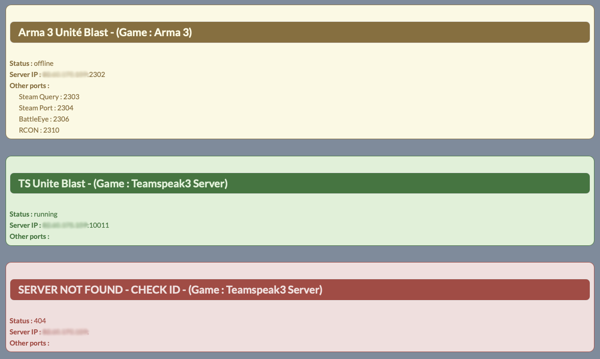
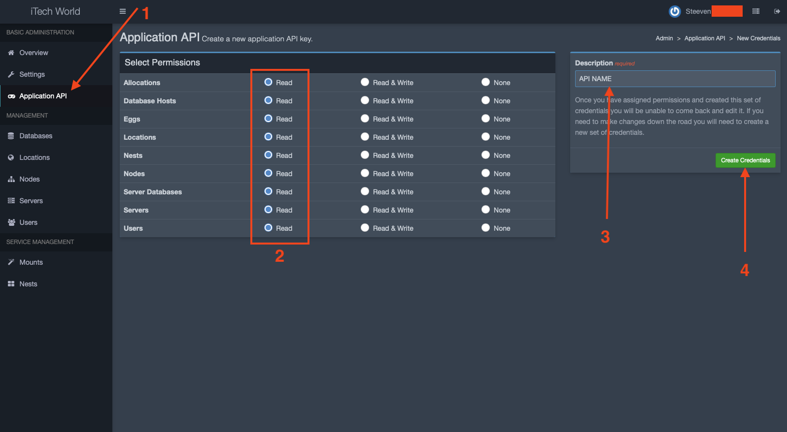
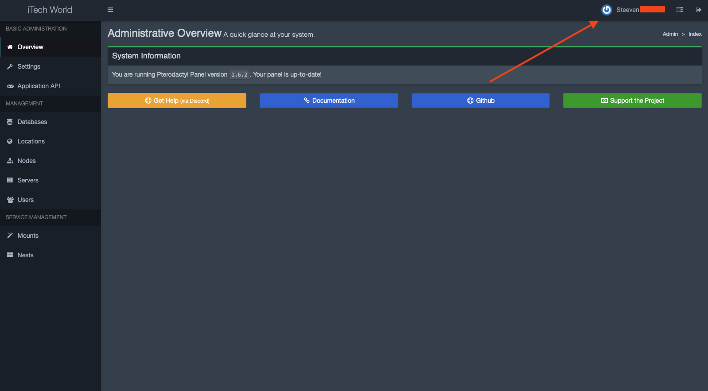
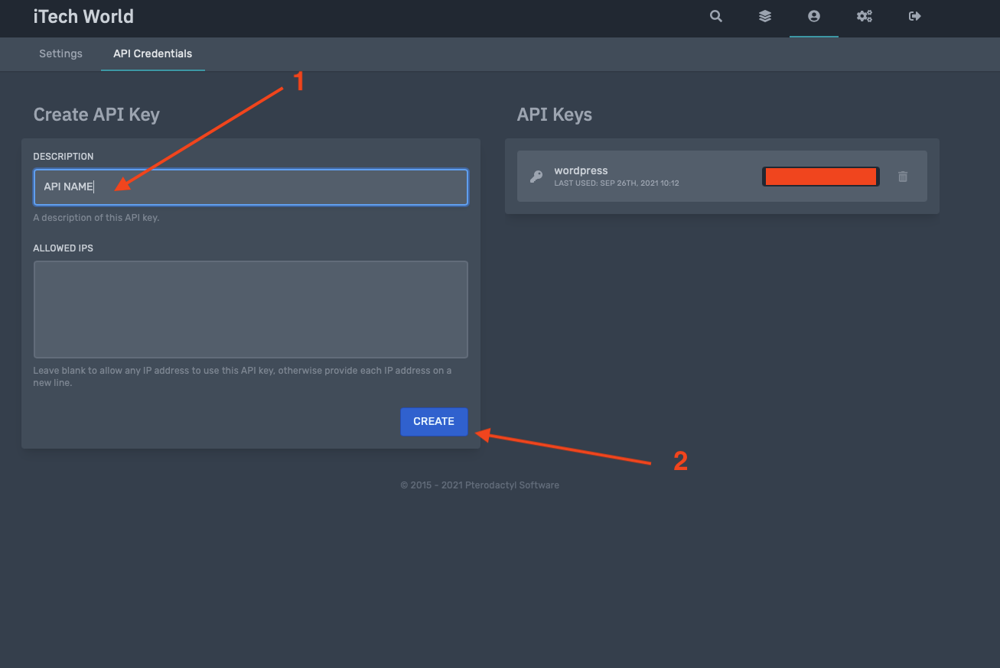
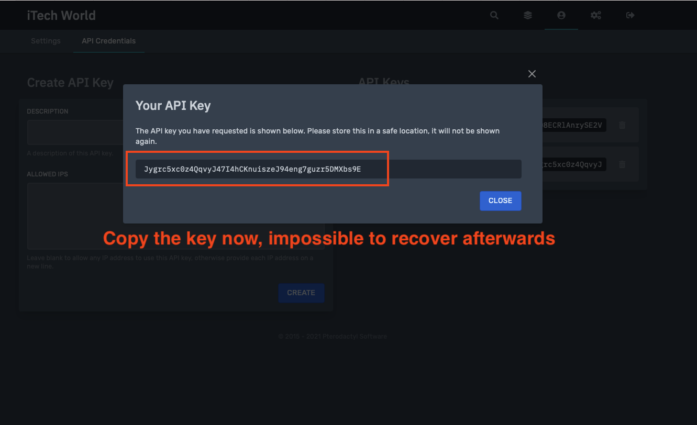
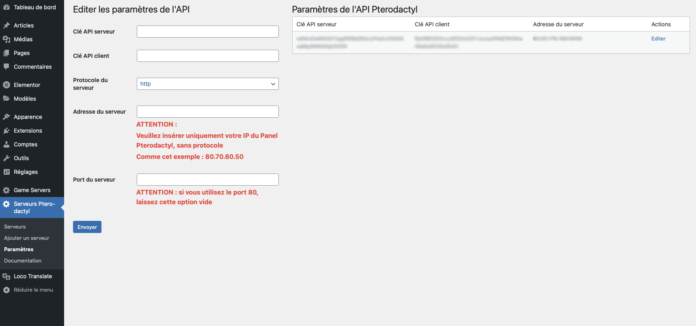
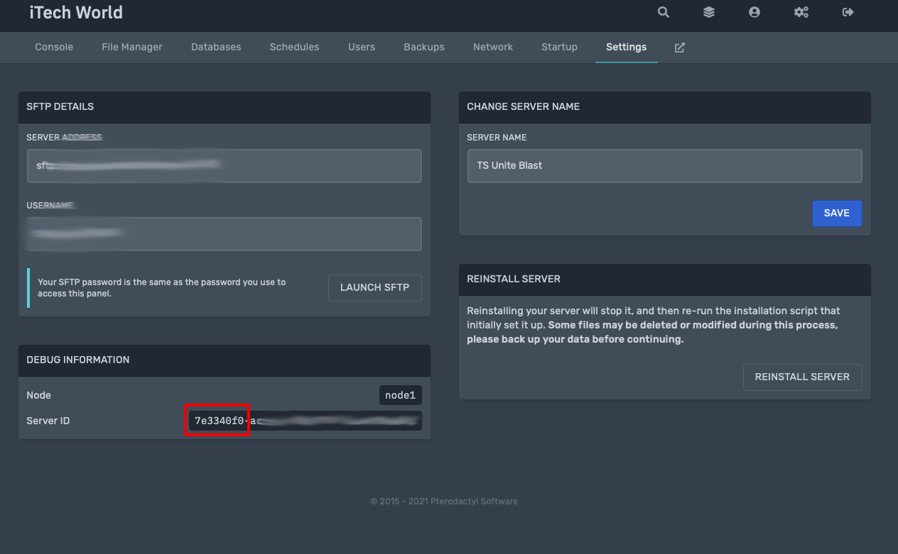

<!-- PROJECT LOGO -->
 

  

<h3 align="center">Pterodactyl games servers status for WordPress</h3>

  

    Allows you to see all the information of your game servers from the Pterodactyl Panel on your website !
     

<!-- TABLE OF CONTENTS -->

  
Table of Contents

  <ol>
    <li>
      <a href="#about-the-project">About The Project</a>
      <ul>
        <li><a href="#built-with">Built With</a></li>
        <li><a href="#translations">Translations</a></li>
      </ul>
    </li>
    <li>
      <a href="#getting-started">Getting Started</a>
      <ul>
        <li><a href="#Requirements">Requirements</a></li>
        <li><a href="#installation">Installation</a></li>
      </ul>
    </li>
    <li><a href="#usage">Usage</a></li>
    <li><a href="#bug-and-idea">Bug and Idea</a></li>
    <li><a href="#support-me">Support me</a></li>
    <li><a href="#license">License</a></li>
    <li><a href="#contact">Contact</a></li>
  </ol>

# **Test with Wordpress 5.8.1**

<!-- ABOUT THE PROJECT -->

## About The Project

Hosting game servers for friends, they needed to be able to see the status of the servers quickly and easily.

So I decided to set up a Wordpress website and create a plugin to display what they needed.

It is with pleasure that I share this plugin with you.

### Built With

This section should list any major frameworks that you built your project using. Leave any add-ons/plugins for the
acknowledgements section. Here are a few examples.

* [Pterodactyl API](https://dashflo.net/docs/api/pterodactyl/v1/)
* [Wordpress](https://wordpress.com/)
* [PHP](https://www.php.net)

### Translations

This plugin has two translations :

- English
- French

<!-- GETTING STARTED -->

## Getting Started

### Requirements

#### Pterodactyl Panel - API key server

You need to set up an API server key with read permission. Follow these steps :

- Go to 'Administration Panel / Application API'
- Click on 'Create New'
- Select 'Read' for Allocations, Eggs, Locations, Nests, Servers (you can select all if you prefer)
- Make sure you register the key provided

#### Pterodactyl Panel - API key client

You need to set up an API client key with read permission. Follow these steps :

- Click on your username at the top right
- Click on 'API Credentials'
- Enter a description for your Key
- Click on 'Create'
- Make sure you register the key provided

#### Pterodactyl Panel - informations

You need the following information :

- The PROTOCOLE of your address of your Pterodactyl Panel (HTTP or HTTPS)
- The IP address of your Pterodactyl Panel (80.70.60.50)
- The PORT of your Pterodactyl Panel (if you use port 80, leave this option blank in settings)

### Installation

1. Download the folder `pteroq-server-status` with all plugin files
2. Place the folder on your FTP server in `wp-content/plugins/`
3. Activate the plugin in your admin panel of your Wordpress website
4. Go to the new menu `Pterodactyl server status / Settings`
5. Enter the information retrieved previously

<!-- USAGE EXAMPLES -->

## Usage

To add a server, go to Add server and add the first part of the UUID. You can find it in your server settings.

After adding it, you will find it in the list of servers.

<!-- ROADMAP -->

## Bug and Idea

See the [open issues](https://github.com/steeven-th/pterodactyl-status-server-wordpress/issues) for a list of proposed
features (and known issues).

<!-- CONTRIBUTING -->

## Support me

You can buy me a coffee to support me **this plugin is 100% free**.

[Buy me a coffee](https://www.buymeacoffee.com/steeven.th)

<!-- LICENSE -->

## License

Distributed under the MIT License. See `LICENSE` for more information.

<!-- CONTACT -->

## Contact

Project Link: [here](https://github.com/steeven-th/pterodactyl-status-server-wordpress)
